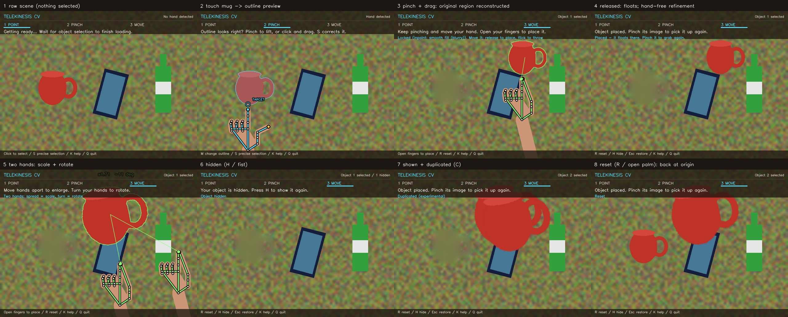
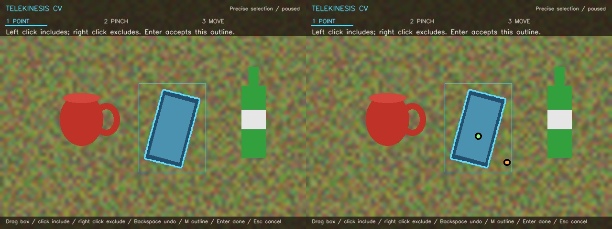
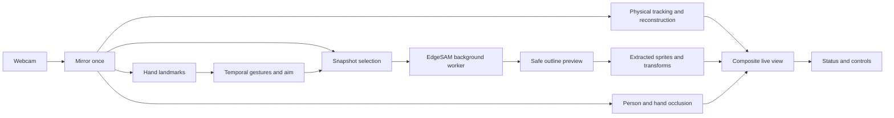

# Telekinesis CV — Reality Manipulation

Touch a **real object** in the mirrored webcam image with your fingertip → its actual
silhouette highlights → **pinch** to lift its extracted appearance → move, throw, scale,
rotate, hide, restore, reset, duplicate. The physical object never moves; only its
appearance in the video does, and its original spot is painted over with reconstructed
background. No object classes, no synthetic assets. Compact local Python + OpenCV.

Built to explore a practical computer-vision illusion: turn something already on your
desk into an interactive image, without a GPU, cloud inference, or a predefined object
catalogue. The core workflow is **touch → preview → pinch → manipulate → restore**.



*The preview uses the real EdgeSAM model and application pipeline on a synthetic desk
with drawn hands. It is a reproducible illustration, not a recording of webcam performance.*

## Start

Windows, Python 3.13 (tested on an i7-1355U, Iris Xe, no CUDA):

```powershell
python -m venv .venv
.\.venv\Scripts\python.exe -m pip install -r requirements.txt
.\START.cmd              # or: .\run.ps1 --debug
```

First launch downloads four version-pinned, SHA-256-checked models (~46 MB total):
EdgeSAM encoder + decoder, MediaPipe's hand landmarker, and its selfie segmenter.
All model downloads are bounded and installed atomically. Verified caches work offline;
an interrupted or corrupt download is repaired on retry. Telekinesis does not record
or upload webcam frames. Its network code downloads model assets only; third-party
MediaPipe builds may emit their own diagnostic network traffic.
**F** toggles fullscreen; the window is resizable. The default view shows **POINT → PINCH → MOVE**
and the next action. **K** opens the full control guide. Hand skeleton lines are always
visible on detected hands; thumb/index tips are highlighted and the skeleton turns green
while pinching. The labelled **TARGET** ring shows where object selection is aimed.

To prepare the models before connecting a camera:

```powershell
.\.venv\Scripts\python.exe tools\prepare_models.py
```

No accounts, API keys, backend service, or deployment are needed. On other platforms,
use Python 3.13, create the same environment, install `requirements.txt`, and run
`python main.py` from that environment. Windows is the primary interactive target;
Linux is covered by offline CI, not a claim of verified live-camera support.

### First successful interaction

1. Keep the camera fixed and place a distinct, opaque object on a contrasting surface.
2. Wait for model loading to finish. Raise an open hand, then touch the object's image
   with your index fingertip and hold steady until the cyan outline appears.
3. Pinch when the outline is right, move your hand, pause, and open your fingers to place it.
4. Use **R** to reset or **Esc** to restore the physical object's unmodified appearance.

For a reliable first try, click the object's visible body to request an outline, then
click and drag the outlined object to lift it. It drives the same selection
and manipulation pipeline and helps isolate a hand-tracking problem. The active object
number, hidden count, and current action are shown above the camera view. Up to six
extracted images (including duplicates) can exist at once; **Tab** changes the active one.

## How to use it (gestures)

| You do | What happens |
| --- | --- |
| **Touch** an object in the image with your index fingertip and hold still ~¼ s | A ring fills, then "Finding the object…"; a thin cyan outline shows the silhouette |
| Keep pointing at the outline | It stays steady. Use **M** or right-click for a different plausible outline |
| **Pinch** (thumb + index) | Locks **and** grabs the object; its original spot is reconstructed |
| Move the pinched hand | The object follows, keeping your grab offset (no snapping) |
| Open fingers slowly | Placed: it floats where you left it ("frozen in space") |
| Flick, then open fingers | Thrown: gravity, bounces, damping, lands on the bottom edge |
| Pinch a floating or flying object | Grab/catch it again |
| **Second hand pinches** while the first holds | Two-hand mode: spread/close = scale (0.25×–4×), turn the hand line = rotate |
| Twist the holding hand (>20°) | One-hand rotation beyond a dead zone (T toggles) |
| **Fist** held 0.6 s (nothing held) | Hide / show the active object (fades; background stays) |
| **Fist** of the other hand while one hand holds | Duplicate (experimental) |
| **Open palm**, fingers spread, held still 1.5 s | Reset: original position, scale, rotation, visible |

Progress rings show fist/palm actions before they fire. A single noisy frame never
triggers anything. The mouse is a fallback "hand": hover to aim, left-button = pinch,
drag = move, fast drag + release = throw, right-click = next outline, wheel = scale,
Ctrl+wheel = rotate. Use it to tell segmentation failures apart from hand-tracking ones.
An initial click requests selection immediately, without needing to hover first. It never
extracts an unseen outline: confirm the preview with a second click/drag or a pinch.
Mouse movement alone does not take control away from a detected hand; clicking does.

### When one point is ambiguous: precise selection

Press **S** to pause the camera view. **Drag a box** around the whole object, or **left
click** visible parts that belong to it. **Right click** regions to exclude them. Additional
points correct the same snapshot, reusing its image encoding. **Backspace** undoes the
last correction; **M** changes outlines. When the outline is right, press **Enter** to
resume the camera, then pinch or click/drag to lift it. **Esc** cancels.

This works through spatial prompts, with no object class list or special cases for mugs,
paper, tools, or other categories. A single pixel can ambiguously mean a part, an entire
object, or background. Corrections express that intent; no model can guarantee a perfect
outline for every object in every scene. Keep the scene still while the view is paused.
Confirmed corrections are preserved; automatic hand-free silhouette refinement will not
overwrite their inclusion/exclusion choices.



| Key | Action |
| --- | --- |
| Esc | Release the active object back to reality (original visible again) |
| R | Reset active object · H hide/show · C duplicate · Z freeze/unfreeze (drop) |
| M | Next candidate outline · Tab next object · X release all |
| S | Precise selection: paused view, include/exclude points and box prompts |
| B | Switch background fill (memory/plate · smooth fill · FSR texture guess) |
| P | Capture a **clean plate** (only valid if you physically removed the objects) |
| O | Occlusion in front of objects: hands → whole person → off |
| D | Debug overlay · K key legend · F fullscreen · E retry model after an error · Q quit |
| T | Toggle one-hand twist rotation |

Options: `--debug`, `--camera 1`, `--backend msmf`, `--hands auto|1|2`,
`--min-scale/--max-scale`, `--max-area 0.30`, `--threads 4`, `--no-person`,
`--headless --seconds 20` (metrics only).

Esc also cancels an in-progress selection or early pinch, so a late model result cannot
grab an object after cancellation. Point selection excludes oversized/background surface
masks; precise selection allows deliberate edge/large-object prompts (up to 95% of the
frame). Person and hand hints are soft evidence, never semantic vetoes. Uncertain outlines
remain visible for correction and require confirmation; nonfinite/empty masks are rejected.

### Troubleshooting

| Symptom | What to try |
| --- | --- |
| Camera cannot open | Close other camera apps, check the shutter and camera permissions, then try `--camera 1` or `--backend msmf`. |
| Model unavailable | Read the console error, reconnect for downloads if necessary, then press **E**. Retry reloads the model without requiring a new aim. |
| No outline / wrong outline | Click a visible part to retry immediately; **M** chooses alternatives. **S** pauses the view for box/point corrections. |
| Gestures feel unreliable | Start with open fingers so pinch can arm; try mouse controls to check segmentation separately. |
| Slow interaction | Keep `--hands auto`, try `--no-person` or fewer `--threads`; **D** shows stage timings. Two hands and refinement cost more CPU. |
| Tracking lost after a camera move | The last pose is deliberately held. Use **Esc** or **X**, steady the camera, and select again. |
| Blurred region behind a moved object | Inpainting is a guess. Capture **P** with objects physically removed **before selecting** for a clean background plate. |
| FSR is not available | Install `opencv-contrib-python` from the pinned requirements; avoid mixing multiple OpenCV packages in one environment. Smooth fill remains usable if FSR fails. |

## What happens under the hood (and where)

The stack is **Python 3.13 · OpenCV contrib · NumPy · MediaPipe Tasks · ONNX Runtime CPU**.
Dependencies are pinned in `requirements.txt`. There is no web frontend or backend.



**Coordinates.** Every frame is mirrored once (`main.run`), before hand tracking,
segmentation and drawing, so landmarks, prompts, masks and display share one pixel
system. MediaPipe's normalized x/y are scaled by width and height separately
(`hand_tracker.py`).

**Detection vs segmentation vs tracking.** *Detection* finds things (here: MediaPipe
detects hands; no object detector or class list is used). *Segmentation* decides which
exact pixels belong to an object: EdgeSAM, a promptable SAM-family model, answers "what
coherent object is at this point?" (`segmentation.py`). It runs **once per selection**,
in a background thread (~0.3–1.1 s encode, ~80–340 ms decode measured here). *Tracking*
follows that same object afterwards, cheaply, every frame: `scene.ObjectTracker` matches
the object's own appearance (masked normalized cross-correlation) in a small window around
its last position. It can say OCCLUDED/LOST and hold still; it never searches for, or
switches to, another object.

**Point prompts and the hand.** The prompt is placed slightly *ahead* of your fingertip
along the finger (`selection.aim_point`), because the fingertip pixel is skin. The
snapshot being segmented is the live frame *with your hand in it*, so points on your hand
are sent as **negative** prompts. Anatomical palm/finger regions and selfie foreground are
ranking hints only: they can overlap an object without its being skin. They never veto an
otherwise usable outline, or automatically trim the confirmed cut-out.
Transforms are explicit: BGR→RGB, SAM normalization, resize longest side to 1024,
pad right/bottom; the 256² mask logits are upsampled, **the padding is cropped, then**
resized back (`restore_logits`). Skipping the crop would stretch every mask.

**Precision and low light.** Mask cleanup first keeps the component directly under the
target, or the nearest foreground if the target is just outside the edge. It retains
only nearby fragments (such as a separated handle), removes distant neighbours, and
preserves genuine holes. Stability is measured around that object rather than across
unrelated pixels. Low-confidence silhouettes are labelled uncertain and can be corrected
instead of silently discarded. In dim scenes, gentle luminance contrast and gamma preparation
help the segmentation model; the live image, extracted sprite colours, and cached scene
pixels remain original. Bright scenes bypass the adjustment.
Before showing the default outline, one additional decoder pass uses a box around the
candidate to check its boundaries. It reuses the same image encoding and keeps the
initial result unless the new mask passes safety filters, agrees closely in shape and
size, and has more stable edges. This adds decoder time, not another image encoding.

**Choosing the whole object.** SAM returns several candidates (part / object / bigger).
Its own quality score favours small crisp parts (a door over the whole truck), so
`rank_candidates` drops oversized/surface guesses for ordinary pointing and applies soft
foreground penalties, then prefers the **largest** candidate whose adjusted score and *stability*
(does the mask change if the logit threshold moves ±1?) are close to the best. Stability
is what rejects a merge of two neighbouring objects (their seam is uncertain).

**Binary vs soft masks, alpha compositing.** A binary mask is 0/1 per pixel. We feather it
inside its silhouette (`feathered_alpha`) into a *soft* alpha 0…1 so edges blend instead of looking
cut out, without erasing thin handles or adding background pixels. The extracted sprite
is `RGBA = camera pixels + alpha`. Compositing uses
premultiplied colour: `out = src·α + dst·(1−α)`; premultiplying before warping avoids
dark fringes (`manipulation.render_sprite`).

**Transforms.** Each object has position, scale and 2D angle. `ManipulatedObject.matrix`
builds one affine matrix `T(position)·R(angle)·S(scale)·T(−anchor)`, and the pixels and
alpha are warped with the **same** matrix. This is image-plane rotation: it cannot show
the back of a mug.

**Hiding the original (reconstruction).** The mug physically stays, so its region is
painted over (`scene.Reconstruction`). Best source first: a **clean plate** (P, captured
with objects physically removed), or **scene memory** — a frame from the last ~40 s in
which that spot looked different while its surroundings matched (only if the object was
placed or moved after the app started). Otherwise **inpainting invents** the pixels: an
instant smooth pyramid fill, plus OpenCV-contrib FSR computed in the background (B
switches). A frame that contains the object is *not* a background plate. The patch is
moved with the tracker and re-lit using the surrounding ring's colour drift. Expect a
blurry/smeared patch with inpainting, and a visible seam if lighting changes a lot.

**Occlusion.** MediaPipe's selfie segmenter gives a real per-pixel person mask (~5–35 ms
here). Pixels that are *person* and near a *hand* are drawn in front of manipulated
objects; the whole person can be put in front with O. The webcam gives no depth, so the
layering is a rule (hands in front), not measured depth. Anatomical palm/finger hints avoid
the invented forearm and gaps between fingers. Selected-object pixels take precedence over
selfie foreground during reconstruction/tracking; live finger/palm hints retain occlusion.
Person masks own their memory before MediaPipe releases its native inference buffers.

**Temporal gesture logic.** `PinchGesture` is a state machine
`OPEN → PINCH_CANDIDATE → PINCHED → RELEASE_CANDIDATE → OPEN` with two thresholds
(hysteresis), minimum durations, and arming (fingers must be seen open first). Better
than `if distance < threshold` because one noisy frame can neither grab nor drop.
Held objects follow the **palm centre** (not the thumb–index midpoint), so opening the
fingers does not jerk the object; throw velocity is a least-squares fit over timestamped
samples *before* the fingers opened. A holding hand may vanish for 0.25 s without
dropping; longer loss places the object where it is (never a throw).

**Keeping it real-time.** One running + one replaceable pending segmentation job (no
queue); every job carries snapshot/prompt ids so late answers for an abandoned aim are
discarded. Encodings are reused for new aim points while fresh and not hidden by the
hand. MediaPipe runs its palm detector every frame while it sees fewer hands than it is
asked for, so the app tracks **one** hand while pointing and switches to two only while
an object is held. Person segmentation runs only when objects exist.

## Honest limitations

- Segmentation quality varies with contrast, clutter, thin/transparent/reflective objects
  and lighting. When the default outline is wrong, press M or move the TARGET ring.
  Lighting preparation cannot recover detail hidden in near-black pixels, remove sensor
  noise perfectly, or guarantee separation of an object from a strong cast shadow.
- Pinch/aim use 2D landmarks; bad lighting or motion blur still causes misses.
- Reconstruction without a clean plate or memory is a guess (blurred). Shadows cast by the
  real object are outside the mask and stay visible. Big camera moves break alignment;
  tracking is translation-only (no rotation/scale of the physical object) and holds its
  last pose when unsure.
- The sprite is a snapshot of the object; later lighting changes are not applied to it.
- Two-hand manipulation costs more CPU (the second hand needs palm detection).
- Duplication is experimental. No 3D, no depth, no novel views.

## Files and verification

`main.py` (camera loop, `App.step` per-frame pipeline, UI), `hand_tracker.py`
(landmarks, smoothing, velocity), `selection.py` (gesture state machines, aim, selection
states), `segmentation.py` (EdgeSAM, transforms, ranking, worker), `scene.py` (person
segmentation, tracking, reconstruction), `manipulation.py` (sprites, grab/throw/scale/
rotate, physics, rendering). `tools/` has an evaluation sheet on public SAM demo photos
and a full-sequence demo on a synthetic desk.

```powershell
.\.venv\Scripts\python.exe -m unittest test_core test_selection test_pipeline
.\.venv\Scripts\python.exe tools\fixture_demo.py demo.jpg
.\.venv\Scripts\python.exe tools\eval_selection.py eval.jpg
.\run.ps1 --headless --seconds 20
```

`test_pipeline.py` uses the real model on a synthetic desk (irregular mug with handle,
phone, bottle) with a drawn hand whose landmarks drive the app: selection with the hand in
frame, stale-result rejection, grab offset, reconstruction, hide/show, reset, duplicate,
release, throw/landing, hand loss, two-hand scale/rotation, camera shift and scene change.
These prove the pipeline mechanics, **not** how it feels with your real hands and objects.

### Reproducible checks

Fast offline tests do not need model files or a camera:

```powershell
.\.venv\Scripts\python.exe -m unittest test_core test_selection test_reliability test_precision
.\.venv\Scripts\python.exe -m pip check
```

To run the full interaction suite instead of silently skipping missing-model tests:

```powershell
.\.venv\Scripts\python.exe tools\prepare_models.py --segmentation-only
.\.venv\Scripts\python.exe -m unittest discover -v
.\.venv\Scripts\python.exe tools\fixture_demo.py .cache\fixture-demo.jpg
.\.venv\Scripts\python.exe tools\precision_demo.py .cache\precision-demo.jpg
```

The fixture demo has a time limit, reports model failures, and closes workers on failure.
Its exported images contain synthetic fixtures only. GitHub Actions runs offline checks
on Windows and Linux plus the real-model interaction suite on Windows. Downloads happen
explicitly before integration tests; a missing model is a CI failure, not a passing skip.

`hud.py` owns width-aware camera feedback, `model_assets.py` owns download integrity,
`precision.py` owns frozen-frame correction prompts; `test_precision.py` covers native-buffer
ownership, click-first selection, foreground false positives and correction state/results.
`lighting.py` owns inference-only dim-scene preparation, and `test_reliability.py` covers model recovery, corrupt downloads, rejected candidates,
mouse controls, cancellation, delayed refinement and HUD sizing. Historical experiment
records remain in `.ai/`; archived sources are not part of the active application.

## Models and attribution

- [EdgeSAM](https://github.com/chongzhou96/EdgeSAM) provides promptable segmentation;
  the [ONNX assets](https://huggingface.co/chongzhou/EdgeSAM) are pinned to a repository
  revision. EdgeSAM uses the [S-Lab License 1.0](https://github.com/chongzhou96/EdgeSAM/blob/master/LICENSE),
  which permits non-commercial use and requires separate permission for commercial use.
- [MediaPipe](https://github.com/google-ai-edge/mediapipe) supplies hand landmarks and
  selfie segmentation. Model URLs and hashes are explicit in the source.
- The optional evaluation sheet uses the original [SAM demo photographs](https://github.com/facebookresearch/segment-anything/tree/main/notebooks/images).

Model files are downloaded locally and excluded from Git. This repository does not
currently declare a separate license for its own source; choosing one remains an owner
decision. Do not assume a blanket permissive license covers the third-party models.
